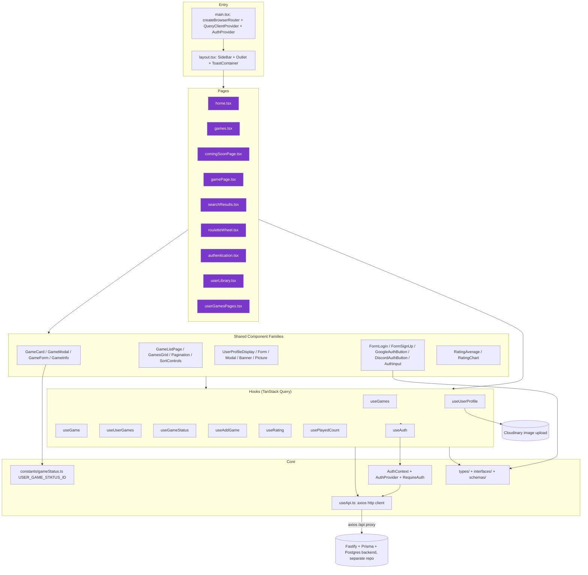
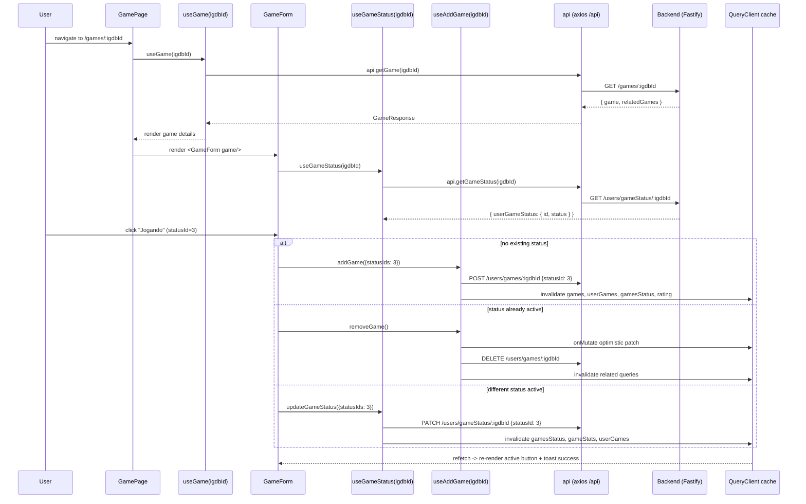

# Codebase Map

> Auto-generated by Cartographer. Last mapped: 2026-09-12T18:18:19Z

## System Overview

React 18 + Vite + TypeScript + TailwindCSS SPA for "Lib" — personal game-library tracker, IGDB-backed catalog + per-user status/rating/completion tracking. Backend: separate Fastify+Prisma+Postgres repo (`lib`), reached via `/api` (Vite dev proxy → `localhost:3333`). State: TanStack Query v5 for all server state, React Context only for auth. Styling: Tailwind, custom dark-theme tokens, `tailwind-merge` for conditional classes. Forms: `react-hook-form` + `zod`. Routing: `react-router-dom` v6 `createBrowserRouter`. No test files anywhere.



## Directory Structure

```
src/
  assets/                    static images
  components/                shared UI components (flat)
    gamesComponents/          GameCard/GameModal/GameForm/GameInfo/GamesGrid family
    userGamesComponents/      profile display/edit family
  constants/                 USER_GAME_STATUS_ID
  contexts/auth/             AuthContext, AuthProvider, RequireAuth
  hooks/                     TanStack Query hooks + useApi (axios client)
  interfaces/                component prop types (games/ui/user)
  pages/                     one file per route
  schemas/                   zod schemas (login/signup/profile)
  types/                     domain types (games/user/rating/sidebar)
  utils/
docs/                        this map
```

## Full Routing Map

All routes are children of one `<Layout/>` (persistent `SideBar` + `ToastContainer`, via `<Outlet/>`).

| Path | Component | File | Auth-gated? |
|---|---|---|---|
| `/auth` | `Authentication` | `pages/authentication.tsx` | No |
| `/` | `Home` | `pages/home.tsx` | No (renders differently if logged in) |
| `/search/:query` | `SearchResults` | `pages/searchResults.tsx` | No |
| `/games` | `Games` | `pages/games.tsx` | No |
| `/games/comingSoon` | `ComingSoonPage` | `pages/comingSoonPage.tsx` | No |
| `/games/:igdbId` | `GamePage` | `pages/gamePage.tsx` | No (interactive parts hidden if logged out) |
| `/roulette` | `RouletteWheel` | `pages/rouletteWheel.tsx` | No (but needs `user.id` internally — see Gotchas) |
| `/userLibrary` | `UserLibrary` | `pages/userLibrary.tsx` | **Yes** (`RequireAuth`) |
| `/userLibrary/:status` | `UserGamesPageByStatus` | `pages/userGamesPages.tsx` | **Yes** (`RequireAuth`) |

## Module Guide

### Game card / modal / form family (`src/components/gamesComponents/`)

Core reusable "show a game, let a user act on it" unit.

| File | Role |
|---|---|
| `gameCard.tsx` | Cover thumbnail, 4 sizes (`small`/`medium`/`compact`/`larger`). Exports `GameCard` + `getGameTag()` helper (also used standalone by `dlcAndOriginalGameArea.tsx`). `CATEGORY_TAGS` (IGDB category id → PT label) + `TEXT_HINTS` (regex fallback via name/summary when category id missing). `interactive` prop toggles `<button>` (default) vs plain `<div>` — exists solely so callers who already wrap the card in a router `<Link>` don't nest a button inside an anchor. |
| `gameModal.tsx` | Radix `Dialog` wrapper for game popovers; visually-hidden title for a11y. |
| `gameForm.tsx` | Status button row (Jogado/Jogando/Backlog/Lista de Desejos), filtered by whether `game.releaseDate` is past. Toggling active status removes it; different status updates; no status adds. Renders `PlayedCount` only when status is PLAYED. |
| `gameInfo.tsx` | Modal body: cover + name + `GameForm` + `RatingAverage` (or login prompt) + "Ver Detalhes"/"Cancelar". |
| `gamesGrid.tsx` | Grid wrapper, `GameCardData[]` → `GameCard` (`size="medium" enableModal`), falls back to `EmptyState`. |

Interconnection: `GameCard(enableModal=true)` owns local `open` state, lazily mounts `GameModal → GameInfo → (GameForm, RatingAverage)`. Every listing context that wraps `GameCard` in its own `<Link>` (home, search, similar games, game-list sections) passes `interactive={false}`.

### Auth flow

| File | Role |
|---|---|
| `contexts/auth/authContext.tsx` | `AuthContextType` (`user: Partial<User> \| null`, `loading`, `login`, `signup`, `logout`). |
| `contexts/auth/authProvider.tsx` | Hydrates `user` via `api.me()` on mount. Whole app tree gated behind `!loading`. |
| `contexts/auth/requireAuth.tsx` | Redirects to `/auth`, stashes `location.pathname` in `localStorage['redirectAfterLogin']`. |
| `hooks/useAuth.ts` | `useContext(AuthContext)`, throws outside provider. |
| `formLogin.tsx` / `formSignUp.tsx` | react-hook-form + zod; read/clear `redirectAfterLogin` on success; render Google/Discord OAuth buttons. Use `useContext(AuthContext)` directly rather than `useAuth()` (inconsistent, functionally equivalent). |
| `googleAuthButton.tsx` / `discordAuthButton.tsx` | Plain `<a href>` full-page redirects to backend OAuth endpoints. |
| `useApi.ts` (`api.login/signup/logout/me`) | axios instance, `withCredentials: true`, 401 interceptor clears cookies on `session_expired`/`unauthorized`. |

### Custom hooks (`src/hooks/`)

| Hook | Purpose | Query keys | Notes |
|---|---|---|---|
| `useApi.ts` | Not a hook — exports `api` (axios wrapper), also called directly by `sideBar.tsx`/`rouletteWheel.tsx`, bypassing hook layer. | n/a | Sort-field mapping gotcha, see below. |
| `useGames.ts` | Catalog: paged, infinite (search), coming-soon, home-featured. | `['games',...]`, `['gamesInfinite',...]`, `['comingSoon',...]`, `['gamesFeatured']` | `keepPreviousData` on paging/sort. |
| `useGame.ts` | Single game + similar games. | `['game', igdbId]`, `['similarGames', igdbId]` | |
| `useGameStatus.ts` | Get/update one game's status. | `['gamesStatus', userId, igdbId]` | Invalidates `gameStats`, `userGames`. |
| `useAddGame.ts` | Add/remove from library. `removeGame` vs `removeUserGame` are near-duplicate mutations differing only in which cache they patch (`['games']` vs `['userGames', userId]`). | invalidates `games`, `userGames`, `gamesStatus`, `rating` | Optimistic + rollback. |
| `useRating.ts` | User rating, community average, distribution. | `['rating', userId, igdbId]`, average key embeds the rating value itself, `['ratings', igdbId]` | Optimistic + rollback. |
| `usePlayedCount.ts` | "Times completed" counter, enabled only when status id === 1 (hardcoded literal, not `USER_GAME_STATUS_ID.PLAYED`). | `['gameStats', userId, igdbId]` | Clamped min 1. |
| `useUserGames.ts` | Library grouped by status + totals + one recommended game. | `['userGames', userId, ...]`, `['games', userId]` | Key-prefix overlaps `useGames`'s `['games', ...]`, distinguished only by arg shape. |
| `useUserProfile.ts` | Profile fetch/update incl. Cloudinary upload. | `['userProfile', userId]` | Two-phase mutation: upload file(s), then submit URL string. |
| `usePrefersReducedMotion.ts` | `matchMedia('(prefers-reduced-motion: reduce)').matches`, read once per render — not reactive to live OS changes. | n/a | Feeds embla-carousel autoplay config. |

### Design tokens (`tailwind.config.js`)

```js
colors: {
  primary: { DEFAULT: '#7A38CA', light: '#9D52E8', hover: '#8B47DB', 'hover-light': '#AE63F9' },
  dark: { bg: '#1A1C26', 'bg-light': '#1F2029', 'bg-lighter': '#25262F', 'bg-darker': '#0F1117', card: '#181920', border: '#2A2B36' }
}
```

Convention: components use `bg-dark-bg*`, `border-dark-border`, `text-primary(-light)`, `bg-primary`, `hover:bg-primary-hover` — no hardcoded hex in `className`, except where third-party libs need literal color values (MUI `Rating` `sx` in `ratingAverage.tsx`, Recharts `Cell fill` in `ratingChart.tsx`) and in `rouletteWheel.tsx` (least-polished page, ad-hoc hex + placeholder text — known, deliberately unfinished per project owner).

### Everything else

| File | Purpose |
|---|---|
| `authInput.tsx` | Password-visibility-toggling input, `forwardRef` for RHF. |
| `button.tsx` | Variant/size system (primary/secondary/cancel/outline/ghost), loading spinner. |
| `categoriesDiv.tsx` | Pill chip — named for IGDB "category" but `gamePage.tsx` actually feeds it genre strings. |
| `details.tsx` | Genres/developers/publishers chips on game page. |
| `dlcAndOriginalGameArea.tsx` | Parent-game link + paginated DLC list, reuses `getGameTag`. |
| `emptyState.tsx` | Generic empty-state message. |
| `gameLaunchersDiv.tsx` | Per-platform release-date pill. |
| `gameListPage.tsx` | Composes `SortControls`+`GamesGrid`+`Pagination`; manages URL query params via manual `URL`/`history.pushState` (not `useSearchParams`, unlike `authentication.tsx`). |
| `gameListSection.tsx` | Home page's 3 list sections; local `RatedScore` calls `useRating` per game (N+1 pattern). |
| `iconButton.tsx` | Icon-only button base for pagination. |
| `pagination.tsx` | First/prev/next/last + "showing X of Y". |
| `platformDiv.tsx` | Platform pill, heuristic console-vs-PC icon by name substring. |
| `playedCount.tsx` | +/- "times completed" widget. |
| `playersInfo.tsx` | Per-status user counts + ratings count. |
| `ratingAverage.tsx` | Dual-layer MUI `Rating` (readonly + interactive hover) + remove button. |
| `ratingChart.tsx` | Recharts bar chart, rating distribution. |
| `searchBar.tsx` | Route-synced search input (`/search/:query`), autofocus + cursor-to-end. |
| `sectionHeading.tsx` | Reusable heading, colored dot + optional icon. |
| `sideBar.tsx` | Desktop nav + mobile drawer; calls `api.logout()` directly rather than via `useAuth()`. |
| `similarGamesSlider.tsx` | Embla carousel of similar games. |
| `sorting.tsx` | Sort field/order + optional status filter (user-library only). |
| `UserGamesDiv.tsx` | Library grouped-by-status sections. |
| `userBanner.tsx`, `userInfo.tsx`, `userProfilePicture.tsx` | Small presentational profile pieces. |
| `userProfileDisplay.tsx` | Profile card + edit trigger. |
| `userProfileForm.tsx` | Profile-edit form, banner/avatar upload w/ preview, dirty-tracking. |
| `userProfileModal.tsx` | Radix Dialog w/ **visible** title (contrast with `gameModal.tsx`'s hidden title). |

## Data Flow — Viewing a Game and Marking Status



## Conventions

- Zod schemas paired 1:1 with react-hook-form via `zodResolver`; form types via `z.infer<typeof schema>`.
- TanStack Query hooks named `use<Noun>`, expose `.mutateAsync` wrapped in plain functions rather than the raw mutation object.
- No hardcoded hex in Tailwind `className` outside third-party libs needing literal colors (MUI, Recharts) and the known-unfinished `rouletteWheel.tsx`.
- `focus-visible:outline focus-visible:outline-2 focus-visible:outline-offset-2 focus-visible:outline-primary-light` on every interactive element.
- `rounded-full` pill badges for small metadata chips; small square dot (`size-1.5 bg-primary`) as section-heading marker.

## Gotchas

1. **CRLF/LF mix** across ~10 files (schemas, auth context, a few pages/components) — noisy diffs, no functional impact.
2. **`interactive` prop on `GameCard`** — prevents `<button>` nested in `<a>`; always paired with `interactive={false}` where the caller wraps the card in a `Link`.
3. **Sort-field name mismatch**: `/users/userGames` backend expects `gameName`/`dateRelease`; only `useApi.getUserGames` maps this via `USER_GAMES_SORT_BY_MAP`. `getGames`/`getComingSoon` pass sort fields through unmapped — different backend routes use different naming conventions.
4. **Two independent status vocabularies**: `GameStatusEnum` (string, order Played/Playing/Paused/Backlog/Wishlist) vs `USER_GAME_STATUS_ID` (numeric, PLAYED:1/PAUSED:2/PLAYING:3/BACKLOG:4/WISHLIST:5 — different internal order). No compile-time link; kept in sync only by matching English key names. `usePlayedCount.ts` hardcodes numeric literal `1` instead of `USER_GAME_STATUS_ID.PLAYED`.
5. **`CategoriesDiv`/`categoryName`** used for genres in `gamePage.tsx` despite the name implying IGDB category (DLC/expansion/etc.) — real category-id classification lives in `gameCard.tsx`'s `getGameTag()`.
6. **`removeGame` vs `removeUserGame`** (`useAddGame.ts`) — near-duplicate mutations, differ only in which cache they optimistically patch. Candidate for consolidation.
7. **`/roulette` not wrapped in `RequireAuth`** despite needing `user.id` internally — shows empty state instead of redirecting when logged out.
8. **`/forgotPasswordPage` link in `formLogin.tsx`** has no matching route — intentional placeholder for a not-yet-built feature (per project owner), not a bug to fix.
9. **Unused dependencies**: `@auth0/auth0-react`, `typescript-cookie` in `package.json`, no imports found in `src/`. ESLint devDependencies present but Biome is the active linter (no `.eslintrc*`).
10. **`usePrefersReducedMotion`** reads `matchMedia` once per render, not reactive to live OS setting changes.
11. **`types/sidebar.ts`'s `MenuItem`** and `interfaces/ui.ts`'s `SideBarItemProps` are leftover types from a `SideBarItem` component that no longer exists (removed as dead code in a prior cleanup) — latent dead types, not caught by file-level orphan scans since the type files themselves are still imported elsewhere.
12. **Local variable names shadow their own type names** in destructured `useQuery` results (e.g. `const { data: GameResponse } = useQuery(...)`) across several hooks — stylistic, not a bug.
13. **`index.html`'s `<body class="bg-dark-bg-lighter">`** vs `Layout`'s root div `bg-dark-bg` — redundant double background declaration, harmless (Layout's div covers the body).

## Navigation Guide

- **Add a new API endpoint**: add method to `hooks/useApi.ts` (`api` object) → wrap in a TanStack Query hook under `hooks/` → consume from a page/component.
- **Add a new page**: create under `src/pages/`, register route in `src/main.tsx`, wrap in `RequireAuth` if it needs a logged-in user.
- **Add a new component**: create under `src/components/` (or a `gamesComponents`/`userGamesComponents` subfolder if it belongs to those families); use existing Tailwind color tokens (`primary`, `dark.*`), never hardcode hex; add `focus-visible` state if interactive.
- **Modify auth**: `contexts/auth/authContext.tsx` (shape) → `authProvider.tsx` (logic) → `requireAuth.tsx` (gating) → `hooks/useAuth.ts` (accessor).
- **Modify game status logic**: `constants/gameStatus.ts` (numeric ids) + `types/games.ts` (`GameStatusEnum`, string) — remember these are two separate vocabularies kept in sync by convention only (see Gotcha 4).
- **Add a new design token**: `tailwind.config.js` `theme.extend.colors` — reference the token elsewhere via `bg-<name>`/`text-<name>`/`border-<name>`, never inline the hex again.
